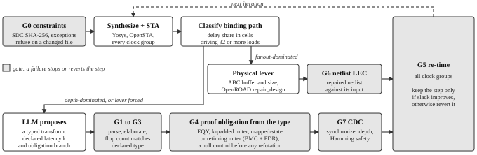

# SlackSmith
### A GenAI RTL optimization loop that proves each RTL change correct, then measures whether it helps

**Nebula @ BITS Goa 2026, Track A (Digital): Constraint Optimization through RTL Enhancement Using Generative AI**

**Team SlackSmith.** Nilay Toshniwal, B.E. Electronics and Communication (senior), BITS Pilani K. K. Birla Goa Campus. Shivani Chaudhary, B.E. Electronics and Communication (2027), BITS Pilani K. K. Birla Goa Campus.

Repository: `github.com/nilaymastaadmi/nebula-slacksmith`. Demo video: `slacksmith_demo.mp4` in the repository root. Every number in this report was produced by running the flow; the command that produced each one is in the cited experiment directory.


<p style="margin:6px 0 2px 0"></p>

*Figure 1. The loop. Shaded boxes are gates; a failed gate stops or reverts the step.*

## 1. Summary

An LLM proposes RTL transforms against a timing report; SlackSmith applies one only once it is **proven correct** and keeps it only if timing **measurably improves**. What is new is the checking: a fingerprint that catches a constraint edit (G0), proof obligations generated from the declared transform type, a null control that catches miter artifacts, and a sealed exam that grades the checker itself (SlackBench). Measured with those, the LLM fails in two ways: transforms that are **wrong**, and transforms that are **correct and aimed at the wrong variable**. On a 55K-cell benchmark and two external designs, **one proven RTL transform bought a timing gain that survived the physical flow**: **+0.846 ns after `repair_design`** on `tv80s`, 2.26 times that design's noise floor, from an unattended proposer that turned out to be an agent running our own tools (§7.8).

**Failure one, correctness.** We asked an LLM for transforms against real timing reports, froze every proposal before running any check, and ran two pre-registered batches. **3 of 12 were formally refuted, 1 more was rejected at precondition, 1 is unresolved.** Of those three, **two are corroborated by a control that closes and one is not**: P5's control does not close at any budget tried, though the one artifact class found in our own miter is ruled out for it (§7.6). One of the three parses, elaborates, passes every precondition, cuts 208 cells, and is wrong. The design's own shipped firmware misses it; 20,000 random instruction vectors miss it; the formal gate caught it in **46 seconds** with a concrete counterexample. **The gates that agentic RTL tools actually ship with would have accepted a broken rewrite.** That count started at 4 refuted; it is 3 because batch 2 caught **our own gate manufacturing a refutation** (§7.1, §9).

**Failure two, relevance.** Then we asked whether the transforms that *are* correct actually help. Mostly they did not, for a measurable reason: the binding paths were **59% to 91% fanout-attributable delay**, which is a net's load, and physical buffering is built to fix that. **OpenROAD `repair_design`, changing zero lines of RTL, closed all three groups** at 20.2% area.

**We over-claimed that and a later measurement caught us.** Earlier drafts said *no RTL rewrite shortens a net's load delay*. The absolute is false: on a path scored **91.4% fanout-attributable**, an FSM re-encoding bought **+3.185 ns** and an unattended fanout split **+1.414 ns**, no group paying (§7.6, §7.7). The honest claim is a **ratio that must name its pair**. Like for like, SDC v3, zero-parasitic, `clk_b`: the FSM re-encoding buys **+3.185 ns** while the physical lever takes the same group **−18.957 to +5.6** in the same run. **About one eighth.** Composed into one file, the three proven transforms are worth **+5.165 ns** on `clk_b` before wires, 54% of the sum of their parts; after the ABC buffering lever they are worth **0.000**; after `repair_design` **−0.237 ns against a 0.24 ns perturbation floor** measured on five netlists. No RTL timing gain on this benchmark survives the physical lever on the paths it was aimed at, and the classifier had routed every one of those paths to that lever before any of it was measured.

**One limit that belongs here and not in a footnote.** **Under a correct classifier the router never selects the RTL lever on this benchmark at all**; the closed-loop runs reached RTL only through the classifier's since-corrected DEPTH verdicts (§9), and every later in-loop RTL result used `--force-lever rtl`, logged as `lever_forced`. That is a finding about the benchmark. The unattended backend has run **13 times**, once on this benchmark (§7.7), and **it is not a bare model**: `claude -p` is an agent with a shell in this repository, and 12 of those 13 sessions used it (§3). On the two external designs where the router chose RTL unforced, four proven transforms from the first six runs bought **0.000, 0.000, −0.268 and −0.421 ns**; six registered runs more on `tv80s` found the one above, and six blind runs did not (§7.8).

### 1.1 What the agent actually automates, and what we cannot claim about it

The practical case for this tool is not that it optimizes better than an engineer. It is that the loop in Figure 1 runs as **one command**, and every step of it is otherwise a human reading a report and deciding.

Fingerprint the SDC (G0); synthesize and time; **classify the binding path** by fanout against depth (~2 s), routing *away* from RTL when the lever is physical; propose (5 to 9 min unattended); **generate and discharge the proof obligation** from the declared type (1 s to 222 s); re-time; accept or revert. End to end, the v2 benchmark closes in 2 iterations in a median **112.7 s** on one core (five protocol runs, 83.9 to 152.7 s, `experiments/loop_runtime/`); the unattended run took **456 s**, one sample.

**What we cannot claim: a speed-up ratio.** No engineer was timed doing the same work, so there is no denominator. What is counted instead is the manual work replaced: the obligation generator writes **326 lines** across three branches (`experiments/speedup_step/`). What is measured is the automation's own cost and the decisions it takes unaided: it reverted three formally proven transforms that made timing worse and declined to spend a proposal on a 91.4% fanout path, both unasked. Synthesis dominates the time; the proposer is minutes, the proof seconds, so a faster proposer would not help.

## 2. The problem, and what is actually new here

**Three things here are ours, stated before the concessions that narrow the rest.** **SlackBench grades a verification methodology**, not a design and not a testbench (§7.4): eight transform pairs with ground truth committed before any checker ran, our own gate scored among them. **G0 catches the one attack no equivalence checker can see** (§5.2): on a byte-identical netlist, changing only the constraint file closes a group, and every checker we own calls the two designs equivalent, correctly, because they are the same file. **A null control runs before any refutation is reported** (§9), because our own gate manufactured three refutations that were harness artifacts.

The difficulty is not proposing a rewrite but knowing whether it is correct. Insert a pipeline stage and the design is equivalent only under a latency offset the checker must be told about, so the profitable transforms are the ones the available checkers cannot express.

**Scoped precisely, because the loose version is false.** Generation-mode agents write any latency they like. The accurate claim is that we found no published **agentic RTL optimizer** that both *changes* latency and *discharges a formal obligation for it*; HLS and retiming flows pair latency changes with sequential equivalence checking, but not with a model's proposal. Dr. RTL (ICCAD 2026) preserves micro-architecture "including pipeline latency"; RTLScout gates on a Verilator testbench with `abc cec` secondary, and CEC structurally cannot see an added register.

**Four neighbours narrow the claim, two of them badly.** **ASPEN** (MLCAD 2025) and **ROVER** (TCAD 2024) pair rewriting with combinational obligations, and ROVER's propose-then-EC-gate loop is **structurally our shape with the search replaced by a model**. **EquivFusion** (arXiv 2604.16571) already derives the obligation from a declared scope; our taxonomy is finer, five types against two, and that is honestly the whole difference. **ElasticMiter** (ASPLOS 2025) proves in Coq what our elastic branch checks, so "agreement modulo k cycles under back-pressure" is **not ours**. What remains: obligation types routed *automatically from a declared transform type* on an open-source stack, four of five in the gate today, and Dr. RTL's 14% sequential-equivalence failure rate is what happens when that routing is left implicit.

**Measuring how often the model is wrong is not new either.** Dr. RTL reports an 86% SEC pass rate and **RealBench** (arXiv 2507.16200) reports **44.2% of GPT-4-Turbo Verilog that passes RTLLMv2's testbenches failing formal verification**. Both measure wrong code escaping a *weak* oracle. What we found measured nowhere is what escapes a checker of the **wrong type** (§6.2, §7, `experiments/slackbench/`).

**What we built.** Transforms are *typed*: the model emits a declared transform type rather than free-text Verilog, and that declaration mechanically determines which obligation is generated. One that cannot be discharged is never reported as a result. The interface classifier (§6.1) decides rigid versus elastic and the declared latency delta decides padded versus plain, so none of the routing is left to the model.

| declared | obligation branch | discharged by |
|---|---|---|
| k = 0, state-preserving | combinational / sequential equivalence | EQY, `yosys-abc dsec` |
| k > 0, rigid interface | k-padded miter | SymbiYosys, BMC + PDR |
| k > 0, elastic interface | stream equivalence | SymbiYosys + `cover` |
| k = 0, re-encoded state | mapped-state equivalence | SymbiYosys, sequential miter |
| k = 0, register moved | **retiming** | SymbiYosys, sequential miter |

Four are routed by the gate and discharged on blocks of the benchmark itself; stream equivalence is proven by a hand-built miter on `sync_fifo`, which is not in `bench_top`, and the gate has no route for it yet. Two pieces of §6 evidence are **fixtures by construction and labelled as such**: the classifier table in §6.1 and the four mutants in §6.2. Those test the *classifier* and the *checkers*, which is what they are for.

## 3. Deliverable coverage

| # | Organizer deliverable | Where it is evidenced |
|---|---|---|
| 1 | RTL timing analysis framework | §5, `sdc/bench_top.sdc`, `tools/remeasure.py` |
| 2 | GenAI-based RTL optimization engine | **Met on `tv80s`, by an unattended agent with a shell in this repository** (provenance below, §7.8). §7, `experiments/survival_tv80/`, `tools/gate_proposal.py` |
| 3 | Critical path and timing violation analysis | §5, `docs/measurement-methodology.md` |
| 4 | Optimized RTL implementation | **Met on `tv80s`**: proven, +0.846 ns after `repair_design`, `experiments/survival_tv80/results/run6/online_variants/` (§7.8). Plus `experiments/composed_rtl/aes_key_mem_composed.v` and `rtl/rv32i_core_P{1,2,3,6}.v` |
| 5 | Timing, frequency and PPA comparison | §8, `experiments/ppa/` |
| 6 | Formal equivalence verification report | §6, §7.5, `experiments/*/NOTES.md` + logs |
| 7 | Interactive demo | **`demo/explorer.html`**, §10 |
| n/a | Benchmark: 5 async domains, generated clocks, CDC, dividers, ~50K cells | §4, `rtl/bench_top.v` |

**The four optimization classes the objectives name, each scored separately.** A class is covered when the engine *proposes* it and the gate *routes* it, not when the report mentions it.

**Provenance is stated per proposal, because the three tiers are not equivalent evidence.** **Frozen**: written against a timing report through the session driving this project, which carries its full context, and committed before any check ran. **Handoff**: written the same way against live loop state. **Unattended**: `claude -p`, no human in the loop, **and not blind, though earlier drafts called it that**. It is the Claude Code agent with a shell in this repository, and its transcripts show 12 of 13 unattended runs using it: §7.8's run 6 made 61 tool calls, reading earlier runs' results and running synthesis, timing and equivalence before it replied (`experiments/survival_tv80/results/agent_*.txt`). No write reached a tracked file. The only blind runs are `experiments/survival_tv80_blind/`, the same CLI with its tools removed (§7.8).

| class | proposals | provenance | branch | honest status |
|---|---|---|---|---|
| logic restructuring | P1, P2, P3, P6, P4, A1, A4, A5 | frozen | 1 | 8 of the 12 frozen proposals |
| | `online_proposer` O1, O2 | handoff | 1 | O1 kept, O2 proven and 11.434 ns worse |
| | `fanout_replication_round_key_update` | **unattended** | 1 | **PROVEN, +1.414 ns on every group** (§7.7) |
| pipelining | P5, A3 | frozen | 2 | **proposed twice, proven never.** A3 refuted, P5 refuted-uncorroborated. The proven `pipeline_cut_rigid` in §6 is hand-built |
| **retiming** | `missing_classes` O1 | **handoff** | 5 | PROVEN, costs 4.616 ns (§7.6) |
| **FSM optimization** | `missing_classes` O2 | **handoff** | 4 | PROVEN, **+3.185 ns**, the largest RTL gain on that group (§7.6). An unattended proposal on an external design also reached branch 4 (§7.2) |

**The engine recommends four of four classes and the evidence is not equal.** Logic restructuring is demonstrated at all three tiers including unattended. Pipelining is proposed at the frozen tier and never proven. **Retiming and FSM optimization exist only at the handoff tier**, so a model with this project's context wrote them, not a blind one: before 11 Sept the gate rejected both by construction (§7.6), so no frozen batch could have held one.

`dretime` also appears inside the ABC physical-lever script, which is a mapping-level pass and **not** the engine proposing a retiming; it is not counted here. **Two experiments each number their proposals O1 and O2**, `experiments/online_proposer/` and `experiments/missing_classes/`; they are always named with their directory here.


## 4. The benchmark

`bench_top` is **55,413 standard cells** hierarchical, the figure this report uses throughout; `tools/bench_size.py` and the demo measure **48,616** on the later flattened, buffered-and-sized netlist, because flattening collapses redundant decode across the module boundary (§7.3) and saves more than buffering adds. Both are ~50K, both are cross-checked against a fresh Yosys `flatten`, so the two are not a contradiction. It has five independent asynchronous clock domains, each with its own active-low async reset and each driving at least one in-RTL generated clock.

| domain | clock | divider | contents |
|---|---|---|---|
| A | `clk_a` | /2 | 8-bit MAC datapath + **RV32I core** running a real instruction loop |
| B | `clk_b` | /3 | 10-state control FSM + LFSR + **AES-128** |
| C | `clk_c` | /4 | UART-style shift block |
| D | `clk_d` | /5 | reloading timer, two compares |
| E | `clk_e` | /2 | 16 x 32-bit config file + **AES-128** |

Crossings form a ring A→B→C→D→E→A: gray-pointer async FIFOs on every multi-bit crossing (16, 8 and 32 bits wide), two-flop synchronizers carrying toggles on every single-bit one. **Four of the five crossings both launch and capture on generated clocks.**

**The /3 and /5 dividers are the deliberate difficulty.** An odd ratio needs two counters, one per edge, ANDed. Simulated with reset released off the source grid at 13.3 ns, /2 /3 /4 /5 measure **exactly 10.000, 15.000, 20.000 and 25.000 ns at 50.0% duty** (`experiments/clkdiv_sim/`), and the SDC must describe generated clocks whose edges derive from both source edges.

Third-party content: the AES-128 core is `secworks/aes`, BSD-2-Clause, vendored unmodified under `rtl/aes/` with its license and a `THIRD_PARTY.md`. The RV32I core is ours, verified against a golden C++ instruction-set simulator over a 400-seed differential regression **whose evidence lives in the `rv32-dsp-soc` repository, not this one**.

## 5. Timing analysis framework, three findings, and the gate below all of them

The SDC is **written once and frozen** before any optimization runs. The agent never edits constraints, so no reported improvement can come from relaxing the measurement.

Generated-clock `-edges` for the odd dividers come from the divider's edge arithmetic (`DIV=3` gives `{6 9 12}`) and agree to the decimal three ways: hand trace, Icarus simulation and OpenSTA's `report_clock_properties`.

One `set_clock_groups -asynchronous` over the five domains exempts every synchronizer path; the only other exception is a false path from the five asynchronous reset ports, which G0 counts, and **no `set_multicycle_path` appears at all**, because a multicycle exception manufactures slack without changing the design.

Three findings changed how we report every number (`docs/measurement-methodology.md`):

**A single library cell was worth 4.83 ns of pure artifact.** The first critical path put 19.5 of 33.0 ns in *two cells*: `sky130_fd_sc_hd__lpflow_isobufsrc_1`, a low-power isolation cell ABC selected on area cost. Excluding the `lpflow` and `probe` families, as standard sky130 flows do, moved WNS **−27.37 to −22.54 with zero RTL change**.

**The measurement tool has a zero noise floor**: swapping a module for *itself* returns 0.000 delta on every path group. **But local RTL changes have non-local effects.** Given that null control, the +1.398 ns a `domain_b`-only change produces on `clk_a` is not noise, it is ABC's global mapping moving an unrelated group. **Reporting rule adopted:** a transform's effect is the delta in the group it touches, and movement elsewhere is reported separately, never folded into the claimed benefit.

### 5.1 Setting a target that means something, and a fix that did nothing

The v1 periods were chosen at 3,584 cells; at 55,413 an 8 ns `clk_a` target demands four times what a single-cycle RV32I reaches in sky130. So `sdc/bench_top_v2.sdc` sets each domain about 10% tighter than its measured requirement, with v1 kept unchanged as the frozen record, and `sdc/bench_top_v3.sdc` (§7.3) does the same for the buffered flow. Under v2 the baseline **meets** `clk_a` at +1.333 ns and the AES-bound domains sit at −4.957; **read those against §8**, where wires exist.

**Finding 1 above was correct and not in effect for eight commits**: the exclusion regex expected unquoted cell names and the liberty quotes them, so every netlist in between carried 203 `lpflow` cells. Found by reading a path report; there was no test. Re-measured: the `clk_a` baseline carried **4.62 ns** of artifact, deltas moved 40 to 50%, **no qualitative conclusion changed**, and `clk_b` and `clk_e` each lose 1.97 ns to the exclusion.

### 5.2 G0, constraint integrity: the one attack no equivalence checker can see

Everything above trusts the SDC. We measured what that trust is worth. On **one netlist, 26,958 cells, byte-identical in every row**, with no RTL edit, no resynthesis and no gate resized, the only thing varied was the constraint file:

| appended constraint | `clk_e` |
|---|---|
| none (honest baseline) | **−0.319 VIOLATED** |
| `set_multicycle_path 2 -setup -to <endpoint>/D` | −0.295 |
| `set_false_path -to <endpoint>/D` | −0.295 |
| `set_multicycle_path 2 -setup -from clk_e -to clk_e` | **+4.860 MET** |

One line closes the group, worth **+5.179 ns**, and it changes nothing at all. An earlier comparison with §7.1's +4.925 is **withdrawn**: different fixtures. **Every checker we own returns "equivalent" on that pair, correctly, because the two designs are the same file.** A project whose entire correctness story is functional equivalence has no defence against a constraint edit.

The narrow version does not pay: aiming the exception at the reported endpoint buys 0.024 ns because the worst path moves to the next endpoint. Only the domain-wide exception works, a conspicuous line in an SDC diff if anyone looks.

So the policy became a gate. **G0 runs before G1**: SHA-256 the SDC actually loaded, compare it against the registered digest, count the timing exceptions, and, when the registered digest is supplied, refuse to report any measurement taken under constraints that differ from it (`sdc_fingerprint()` in `tools/slacksmith.py`, `--expect-sdc-sha`); the demo command supplies it. It is cheap and it closes the one surface G1 to G5 structurally cannot reach.

`experiments/sdc_integrity/` is **exploratory, not pre-registered**, and says so in its own notes: it demonstrates a mechanism rather than testing a hypothesis.

## 6. Formal equivalence: five branches proven, four routed by the gate

| transform | branch | verdict | engine |
|---|---|---|---|
| `fsm_reencode(domain_b)` | 4, mapped-state | **PROVEN unbounded** | PDR |
| `mux_priority_to_parallel(domain_b_onehot)` | 1, scoped | **PROVEN unbounded** | PDR |
| `pipeline_cut_rigid(domain_a)` | 2, k-padded | **PROVEN unbounded** | PDR |
| `pipeline_cut_elastic(sync_fifo)` | 3, stream equivalence | **PROVEN unbounded** | PDR + `cover` |
| one-hot state invariant | supporting lemma | **PROVEN unbounded** | k-induction |

**We measured what the existing checkers do**, rather than asserting it. Given a correct latency-changing transform, with a positive control run first in every case:

| checker | control | correct latency-+1 transform |
|---|---|---|
| `yosys-abc cec` | equivalent | **cannot build the miter** ("different number of latches") |
| `yosys-abc dsec` | equivalent | **NOT EQUIVALENT** |
| EQY | PASS | **FAIL**, 1/1 partitions |
| k-padded miter | n/a | **PASSED, unbounded** |

`cec` cannot express the question; `dsec` and EQY express it and correctly answer no, because the designs are not cycle-for-cycle equivalent. None can express equivalence *modulo k cycles*, so a pipeline gated on any of them can only ever reject a latency change.

**We mutation-tested our own checker, and it failed.** A mutant reproducing a documented deadlock, confirmed by simulation to never produce output, was **PROVEN by PDR in 0 seconds**: the stream-equivalence assert's guard was unreachable and the property vacuously true. Fixed with a `cover` that distinguishes the real design (REACHED) from the mutant (UNREACHABLE).

### 6.1 Choosing the branch: the interface classifier

A k-padded obligation is *wrong* for an elastic interface: pointed at a valid/ready pair with back-pressure it is **refuted in 0 seconds on a correct design**, because no fixed cycle offset exists. **A tool that emits the wrong obligation reports a correct transform as broken.** So the branch is chosen in three passes, each able to overrule the last: **lexical** (handshake ports by name), **structural** (does the candidate reach a flop's D or enable cone), and **formal** (prove output stability under back-pressure).

| module | lexical | structural | formal | verdict |
|---|---|---|---|---|
| `mac_ref` (rigid) | no candidate | n/a | n/a | RIGID |
| `mac_vr_ref` | `out_ready` | reaches `$dff.D` | PASSED | ELASTIC |
| `alias_names` (`vld`/`rdy`) | `o_rdy` | reaches `$dff.D` | PASSED | ELASTIC |
| `axi_style` (AXI prefixes) | `m_axis_tready` | reaches `$dff.D` | PASSED | ELASTIC |
| `costume_ready` | `out_ready` | **REJECTED** | **FAILED** | **RIGID** |

`costume_ready` earns the machinery: handshake-shaped names, not an elastic interface, rejected by two independent arguments. Limits: pass 3 is bounded at depth 16, and flow control that misses the lexical pass is classified rigid, the unsafe direction.

### 6.2 Why simulation is not a substitute, measured on four mutants

**Before the LLM experiment, four hand-built mutants of a known-correct transform, with a control every method passes.** Two of the three invalid mutants escaped a realistic simulation gate: the classic pipelining bug (stage 2 adding the current operand to a product one cycle old) and one wrong on roughly one input in a million that survived 20,000 random vectors; formal refuted both instantly. §7 reproduces this on a real proposal; §7.4 turns it into a suite.

## 7. The GenAI engine, and the experiment we pre-registered

The model receives the OpenSTA critical-path report, the target RTL and the typed transform schema, and emits a declared transform type plus replacement source. The declaration selects the obligation; `tools/gate_proposal.py` runs five gates in order: **parse, elaborate, precondition, formal, timing.**

To measure this honestly we **pre-registered the experiment before writing any proposer code**, and git proves the ordering (`04fa59c` precedes `115fc03` precedes the results). The registration fixed N = 6, fixed the gates, and fixed the anti-tuning rule: *all six proposals committed before any gate ran, none editable afterwards, all six reported regardless of outcome.*

| | transform | declared | parse | elab | precond | **formal** | timing (clk_a) |
|---|---|---|---|---|---|---|---|
| P1 | addsub sharing | k=0 | ✓ | ✓ | ✓ | PROVEN | −1.555 |
| P2 | shifter sharing | k=0 | ✓ | ✓ | ✓ | PROVEN | **+0.485** |
| P3 | comparator sharing | k=0 | ✓ | ✓ | ✓ | PROVEN | −2.102 |
| P4 | mux priority→parallel | k=0 | ✓ | ✓ | ✓ | **REFUTED** | n/a |
| P5 | pipeline cut | k=1 | ✓ | ✓ | ✓ | **REFUTED** | n/a |
| P6 | branch cmp sharing | k=0 | ✓ | ✓ | ✓ | PROVEN | −1.615 |

**4 proven, 2 refuted, 1 improved timing.** The registered primary bar was met by P2, which is also the only proposal both smaller (−351 cells) and faster.

### P4: the proposal that was wrong in the way that matters

P4 one-hot decoded `funct3` and OR-ed the masked arms. It parses, elaborates, passes preconditions and saves 208 cells. EQY refuted it in 46 seconds with the witness `a = ae19f605`, `shamt = 7`, isolating **one failing partition out of 447**: `alu_out` (`llm_proposer/results/P4_counterexample_eqy.log`).

It had folded the shift arms into a ternary:

```verilog
wire [31:0] r_shr = alt ? ($signed(a) >>> shamt) : (a >> shamt);
```

A conditional operator's signedness derives from *both* branches. Pairing a signed branch with an unsigned one makes the whole expression unsigned, that context propagates back into the operands, and `>>>` silently degrades to a logical shift. SRA is then wrong for every negative operand.

`rv32i_core.v` carries a six-line comment warning about exactly this, **ten lines above the code being transformed.** The model had that file as input and made the documented mistake anyway.

### The four-checker column on P4

EQY (formal) **CAUGHT** it in 46 s. Simulation on the design's own shipped firmware loop, 400 cycles: **MISSED**. Simulation on 20,000 random instruction words: **MISSED**. A directed SRAI on a negative operand: caught.

The directed probe shows the bug is fully visible to simulation (gold `ffffffff`, gate `0fffffff`), so both misses are stimulus weakness: the shipped firmware loop contains no shift instruction at all. **The verdict tracks stimulus quality, not bug severity.**

P5 shows the k-padded obligation doing its job in the other direction: refuted in 1 second because `alu_out` feeds the register file and PC, so a declared k = 1 shift is not what the transform actually does.

### 7.1 Batch 2, registered separately, on the AES key memory

Batch 1's registration required any second batch to be registered separately with its N added to the trial count (`dbcd7d3` precedes `004695c` precedes every result). **Trial count: 16.** Batch 2 targets `aes_key_mem`, which holds the worst path on `clk_b` and `clk_e`; `u_aes_b` and `u_aes_e` are two instances of one module, so every edit is measured twice.

| | transform | declared | precond | **formal** | clk_b | clk_e |
|---|---|---|---|---|---|---|
| A1 | mux bank split | k=0 | ✓ | PROVEN | +2.020 | +2.020 |
| A2 | decode duplication | k=0 | ✓ | **UNRESOLVED** | n/a | n/a |
| A3 | read port register | k=1 | ✓ | **REFUTED** | n/a | n/a |
| A4 | one-hot read select | k=0 | ✓ | PROVEN | **+4.925** | **+4.925** |
| A5 | reset unroll (control) | k=0 | ✓ | PROVEN | +0.436 | +0.436 |
| A6 | key mem parity split | k=0 | **REJECTED** | n/a | n/a | n/a |

**A4 takes `clk_b` from −4.957 to −0.032**, zero-parasitic; with parasitics the group is −43.438 (§7.2), so +4.925 is about **11% of the real violation**. **The precondition gate fired for the first time**: A6 declared k = 0 while splitting a 15-entry array in two, the flop count moved by +256, and G3 rejected it before any solver ran. And **A5 is why we registered a control**: it unrolls a reset loop, touches nothing on the read path, and still moves `clk_b` by +0.436, so A4's honest figure is **+4.489 above a change that does nothing**.

**A2 is the batch's real finding, and it is a bug in our gate**, told in §9: EQY prints the same "Failed to prove equivalence" line for a counterexample and for a depth bound, and we matched on the string. Three things did not fit, and the one that mattered was that EQY had proved **128 of 128** partitions feeding the output it failed. A3's REFUTED was re-checked under §9's null control and holds (§7.6).

### 7.2 The second router: which lever, before which transform

Four of batch 1's six proposals were proven correct and three made timing *worse*. The obvious reading is that LLM RTL proposals do not help. The measured reading is more useful.

`tools/classify_path.py` scores what fraction of a path's delay comes from cells driving 32 or more loads. Batch 1's target path is **58.9% fanout-attributable**; the design-level AES path is **91.4%**, with 21.029 ns in a single `nor4_1` driving **300 loads**. Those proposals were aimed at the wrong variable, though not at an untouchable one: §7.6 and §7.7 show two proven RTL transforms moving that same 91.4% path.

The control was registered in advance: synthesize `bench_top` twice from identical RTL under identical SDC, differing only by appending `buffer -N 16; upsize; dnsize` to the ABC script, which Yosys ships in its `-liberty -constr` script and our flow was not running. Both violated groups close, `clk_b` **−4.957 to +12.600 MET**, zero RTL change, 1,419 buffers, identical flop count. Checked rather than trusted: **49,923 of 49,924** obligations discharged, the residual a top-level XOR undriven in *both* designs.

That control has no parasitics; with them **all three groups close**, and §8 carries the numbers and their cost.

On one group under one SDC the ladder runs: best batch-1 RTL transform **+0.485**, best batch-2 **+4.925**, both zero-parasitic; ABC's buffering control **+17.557**; and **`repair_design` +55.805**, the only one with parasitics. The mapping-level control pointed the right way and understated the real pass by **3.2x**.

Two results keep this from being a simple "buffering wins" story. **A4 gained 4.925 ns while leaving max fanout exactly unchanged** (2,193 in gold and in every proven variant), as pre-registered in H2, because synthesis re-merged its duplicated cones. **That re-merge is not universal**: the unattended proposal in §7.7 duplicates a control cone and the mapper keeps it, for +1.414 ns. And **after buffering the remaining violations are mixed, not depth-dominated**, first reported as DEPTH at 0.0% and corrected (§9) to **34.4% and 42.8%** on the tightened fixtures and **42.8% and 28.6%** in the v3 loop. **The two levers are sequential, not alternative.**

**Does any of this transfer off our own benchmark?** Pre-registered on the 20 human-written designs published with Dr. RTL, same flow and thresholds, each at 0.9x its measured requirement: 15 in scope split **5 FANOUT / 3 MIXED / 7 DEPTH**, byte-identical across two executions. The physical lever **closes all 5 fanout-dominated designs alone**, median **3.623 ns**, against 4 of 7 depth-dominated at 0.581; buffering alone does **nothing** for depth-dominated designs (median 0.000, worse on 3 of 7). **The primary prediction was wrong**, because `upsize; dnsize` is gate *sizing*, which helps any path. Dr. RTL's own two high-confidence fanout skills, applied as written: **0 of 4 applications both reduced fanout and improved timing** (`experiments/drrtl_transfer/`).

**Does the router ever fire on its own?** Not on this benchmark, and that is a property of the benchmark rather than of the router. So we pointed it at `i2c_master_top` from the Dr. RTL set, 560 cells, previously classified **DEPTH** at fanout share 0.000, with the target frozen at 0.9x its own measured requirement before the loop ran (`experiments/unforced/`, registered first).

    classify wb_clk_i: DEPTH_DOMINATED (fanout share 0.0) -> rtl

**No `--force-lever`, and no human at any step.** The complete run reads: measure −0.396, classify `DEPTH_DOMINATED`, route to RTL, propose, gate, **refuse**. The gate reported `UNRESOLVED` and the loop declined, though §7.8 shows that verdict was almost certainly a gate defect; its artifacts were not kept. Three runs returned *three different* transforms, all aimed at the wide one-hot `case` compare the classifier reported; a hand-run EQY proof of one left no artifact and is not counted. `experiments/depth_i2c/` (§7.8) re-runs it with everything kept.

**So the router fires and the engine proposes; it has not yet improved this design.**

**Getting there took six runs, and every failure was a defect in our own tooling** that `bench_top` could not expose, from a path score read from the first block rather than the worst to a short CLI timeout. None touches a published result.

### 7.3 The closed loop

`tools/slacksmith.py` runs all of the above as one command (§1.1), logging every decision with its evidence to `decisions.jsonl`.

Against SDC v2 it closes in **2 iterations** (wall clock in §1.1), and the RTL lever never fires because nothing is left for it. To exercise both branches the target must be one the flow cannot already clear, so `sdc/bench_top_v3.sdc` applies v2's methodology to the corrected flow (`sdc/make_v3.py`). Under v3 the physical lever alone closes `clk_b` outright, −18.957 to +5.6; the RTL lever then gates P1, P2 and P3, EQY proves all three, and **the loop reverts all three on G5.** `--lever-policy verdict` lets G5 revert the sizing half of the default `buffer; upsize; dnsize` step, although `buffer` alone meets more groups (§8).

**Rankings change once buffering has run.** P2, batch 1's only `clk_a` improvement at +0.485 ns, was reverted. Isolated on one SDC and one transform differing only in whether buffering runs: unbuffered **+0.485**, buffered **−0.485**, sign flipped. **Batch 1's single winner is a loser in the context the design would ship in.** One transform, one setting; the equal magnitude is reported, not claimed as a law.

**The acceptance bar itself was wrong.** A per-group G5 bar confirmed a sizing step gaining 0.838 ns on `clk_e` while costing `clk_a` 3.466; measured across all groups it is reverted, **4 iterations instead of 8, 1 group violating instead of 2**. Both runs are kept.

**Under v3 with a corrected classifier the RTL lever never fires at all**, so the runs above measured three proven transforms on a path the router should not have sent them to. The flow was the larger lever: **flattening alone moves `clk_a` by +22.446 ns**, because across the module boundary ABC collapses decode logic our wrapper's tied instruction bits make redundant (`experiments/flatten_control/`).

**`repair_design`'s output is formally proven equivalent to its input**: 5,832 compare points, all proven, **38 seconds**. This is translation validation per run, not a proof of the algorithm, and says nothing about whether the timing gain is real.

**Running the loop found three defects in it**, one a string-match fix that read P4's counterexample as UNRESOLVED; the standing regression pins **P4 REFUTED and A2 UNRESOLVED**, and pre-fix logs are kept.

**Two online proposals, both proven, one kept and one rejected by measurement.** O1 moved `clk_e` −25.957 to **−24.079** and was confirmed; O2 was **also PROVEN and made the design 11.434 ns worse**, reverted on G5. Proof and profit are independent questions, shown inside one run on a transform written minutes earlier. "Online beats frozen" is reported **inconclusive at N = 2**.

**What it does not show.** The router never chose RTL here; `--force-lever rtl` overrode it every iteration. O1's stated mechanism was wrong while its number was real, and revert restored *pristine* source, silently discarding O1's +1.878 ns.

### 7.4 SlackBench: we built the exam and published our own score

Every RTL benchmark we found grades a *design* or a *testbench*. **SlackBench grades a verification methodology**: eight transform pairs, ground truth and trap class committed **before any checker ran**, each built to defeat a specific checker's abstraction. The score is a confusion matrix, never one number, because a checker that rejects everything would otherwise win. Totals over 8 cases, case-by-case in `NOTES.md`:

| checker | correct | wrongly ACCEPTED | wrongly REJECTED | cannot express |
|---|---|---|---|---|
| `cec` / `dsec` | 2 | 0 | 1 | 5 |
| EQY | 3 | 0 | 0 | 5 |
| sim lazy / aggressive | 6 / 7 | **2 / 1** | 0 | 0 |
| miter, induction / **PDR (shipped)** | 6 / **7** | 0 | **2** / 0 | 0 / 1 |

Four findings. **A wrong transform survived 19,998 simulated cycles in each of two simulators**, wrong on one input pair in 65,536, with that pair published in advance. **Combinational and sequential EC could not express 5 of 8 questions**, each refusal evidenced by latch counts. **`cec` and `dsec` both confidently rejected an equivalent pair**, because they match latches positionally. And **a k-padded miter is wrong twice under temporal induction and zero times under PDR** (once under the suite's own exclusion rule), because induction quantifies over states no execution reaches. The shipped gate discharges with BMC plus PDR and accepts only on PDR, scoring **7 of 8 with one decline**; the induction row is kept published rather than dropped once it looked worse. **The engine that never lies is the one that sometimes refuses.**

**One of six registered predictions is wrong**: EQY declines both STIMULUS cases rather than refuting one. Prediction 6 registered that our own gate should not sweep its own exam, and it did not. An X-propagation addendum: a testbench comparing with `==` accepts a dropped reset that `!==` catches in 50 cycles, so **the verdict is a property of the comparison operator**. `experiments/slackbench/`.

### 7.5 G7: the gate for the defect equivalence checking cannot express

§7.4 leaves both CDC cases unsolved: every checker there is either unable to express the question or **correct and useless**, since CDC-2's pair really is functionally equivalent and the bug is still there. So we built a seventh gate (`experiments/cdc_gate/`, registered before the code).

G7 checks two things on elaborated RTL. **Synchronizer depth**, structurally: fewer than two back-to-back flops in the destination domain is a missing metastability guard. **Hamming safety**, temporally, via SymbiYosys: the value crossing a boundary must change at most one bit per cycle. The second checks the **property, not the encoding**: CDC-2's gold crossing net is a combinational wire and passes because its value changes one bit at a time.

| case | every checker in §7.4 | G7 |
|---|---|---|
| CDC-1 gold | `cec`/`dsec` cannot build a miter | SAFE, depth 2 |
| CDC-1 gate | reads as a latency change, not a defect | **DEPTH_1** |
| CDC-2 gold | correctly ACCEPT | SAFE, proven to depth 16 |
| CDC-2 gate | correctly ACCEPT, **and the bug is still there** | **REFUTED** |
The counterexample is not about function: the crossing bus goes `0001` to `0010`,
**two bits in one cycle**, so a receiver in another domain sampling mid-transition
can latch `0000` or `0011`, neither the old value nor the new one.

**Six registered predictions, three confirmed and one plainly wrong.** We predicted zero depth violations on `bench_top` and got **six**, every one a clock crossing to its own in-RTL divided version, synchronously related and correct. The scorecard first recorded **"6 of 16 findings are noise"; the true figure is 8**, counting two `UNCLASSIFIED` entries that were also synchronous.

**The cause was that G7 keyed on clock *nets* with no notion of clock *relationships*, and the fix was already in the constraints**: `create_generated_clock -source` declares every derivation in the file **G0 fingerprints**, so `--sdc` reads clock groups from constraints G0 has vouched for. A crossing inside a group gets a `SYNCHRONOUS` verdict and is excluded:

| verdict | without `--sdc` | with `--sdc` |
|---|---|---|
| `DEPTH_1`, all false | **6** | **0** |
| `UNCLASSIFIED` | 2 | **0** |
| `SYNCHRONOUS` | n/a | **8** |
| `MULTIBIT`, the real FIFO gray pointers | 6 | 6 |
| `SAFE`, the real async control crossings | 2 | 2 |

**All eight spurious findings go away and no real one does.**

**Then the exit code was lying**: with clock groups the run exited **0** while six multi-bit crossings sat unchecked. Unchecked verdicts now exit non-zero, and the six gray pointers are discharged on `async_fifo` itself, **both PROVEN to depth 16**. **Three of G7's six bugs produced a confident wrong verdict rather than an error**, caught only because gold ran through every check beside gate.

### 7.6 Two of the four named classes were unreachable by construction

The objectives name pipelining, logic restructuring, **retiming** and **FSM optimization**. For most of this project the engine proposed the first two, and the explanation on the record was that nobody had written the others. **That explanation was never tested and it was wrong.**

G3 required `k = 0 ⇒ flop delta = 0`, with no exception. A retiming moves a register across combinational logic: k = 0, flop count changes. A state re-encoding widens a register: k = 0, flop count changes. **Neither could pass whatever its content.** Worse, `proposer_prompt.md` *advertised* branch 4 to the model while every k = 0 proposal was routed to EQY before its declared branch was read, so a proposer that followed the template was guaranteed a rejection. Measured on our own published one-hot `domain_b`, RTL unchanged: `FAIL(declared k=0 but flop count changed by +12)` through the old gate, `PROVEN` in 64 s through the fixed one.

Branches 4 and 5 are now implemented, both `k = 0` with the flop delta unconstrained, both discharged by the **sequential miter** rather than EQY, because neither leaves a flop correspondence for EQY to pair internal nets across. Against `aes_key_mem`, the module the loop binds on `clk_b`:

| proposal | class | branch | verdict | clk_b |
|---|---|---|---|---|
| `retime_write_decode_forward` | retiming | 5 | **PROVEN** (PDR, 222 s) | **−4.616** (and −4.616 on `clk_e`, +0.274 `clk_a`) |
| `fsm_output_coded_state_assignment` | FSM optimization | 4 | **PROVEN** (PDR, 124 s) | **+3.185** (and +3.185 `clk_e`, +0.528 `clk_a`) |

**Both read "PROVEN, 2 of 3 outputs" for a day, and the partiality was ours.** The miter gave two instances *independent* arbitrary power-up state, which asks whether they agree from any **pair** of starting states: not equivalence, and unsatisfiable by any correct transform. `setundef -init -zero` fixes it: gold against **itself** went from failing `eq_round_key` in 1 s to passing, and both proposals became **unbounded PDR proofs over all three outputs**. The assumption is zero, and it is written into every result JSON.

**What makes those two proofs mean anything is the check on a transform known to be broken.** A3 stays REFUTED under the same assumption, failing `eq_ready` in 1 s. An assumption that proved a known-bad transform would prove anything, and that void condition was registered before the assumption was written.

**The retiming is the worst RTL transform in the project and the FSM re-encoding is the best.** R5 predicted the retiming would not improve its group; it does not merely fail, it costs 4.616 ns. R18 predicted the FSM transform would not materially improve `clk_b`; it bought **+3.185 ns**, the largest RTL gain here, and it is the measurement that falsified §1's absolute.

**Getting there took three tries** and is why the null control in §9 exists. It also cleared a confound: A3 (§7.1) fails on `eq_ready`, an output the control **proves**, so it was never the artifact. **P5 took six attempts.** Its control does not close on `rv32i_core` at any budget tried: on two copies of 2,048 flops this harness **finds** a counterexample in 1 s and cannot **prove the absence** of one in 1800. But the one artifact class found in our own miter, differing power-up states, is ruled out for P5: remove that freedom and the refutation survives. So **P5 is REFUTED with a named limit**.

### 7.7 The unattended run, N = 1

The `cli` backend first ran on 2026-09-11, once its credential was held outside the repository (`tools/preflight.sh` fails if a credential-shaped string reaches a tracked file). **The first attempt died before the model was reached** on an empty binary path; registered as an environmental failure and retried.

**The second attempt ran the loop end to end with no human in it**, 456 s: measure `clk_b = −18.957`, classify `FANOUT_DOMINATED` at 0.9139, propose, gate `G4=PROVEN`, G7 skip, apply. **Three qualifiers belong in this sentence and not in a footnote**: the lever was `--force-lever rtl`, a human flag, because the classifier correctly routes this path to physical; the run was capped at `--max-iters 1`, so the loop's own accept-or-revert step never ran on the proposal; and the +1.414 ns below was measured afterwards by `time_O1.sh`, outside the loop. Request, raw response, variant and decision log are at `experiments/cli_backend/results/run1/`.

Four predictions were registered before the run. **Three held and the fourth was the interesting one.** C1, valid JSON first attempt, held. C2, a G4 verdict with no human, held. C4, logic restructuring rather than retiming or FSM, held.

**C3 said the proposal would not materially improve `clk_b`, and gave a mechanism in advance: the duplicated control nets are aliases and `opt_clean` merges equivalent nets. Both were wrong.** The model's own rationale identified that `round_key_update` gates roughly 384 bit-positions and matched it to the 300-fanout `nor4` the classifier had just reported, then split the cone so the two wide select networks are driven separately. The cone duplication is not an alias and the mapper keeps it: **+1.414 ns on `clk_b`, +1.414 on `clk_e`, +1.967 on `clk_a`, no group paying for it**, under a proof EQY discharges over all outputs.

That is the only batch-3 transform that improved every group, and it has the strongest proof of the three (§7.6). It is also **N = 1**: one design, one sample of a nondeterministic generator, one run. The claim is that the automation path works, not that it works reliably. **And the proposer was not blind**: its session made 20 tool calls before replying, 7 of them running synthesis (`experiments/survival_tv80/results/agent_session_map.txt`), so C1 to C4 describe an agent that could test its own proposal.

### 7.8 The composed RTL, what survives the physical lever, and the depth-side control

The benchmark's optimized file, `aes_key_mem_composed.v`: A4, O2 and O1 merged three-way against the gold file by `compose.sh`, rebuild-checked, **PROVEN** on branch 4 by PDR under §7.6's zero-init assumption (`experiments/composed_rtl/`, registered before synthesis). Measured four ways on `clk_b`, one SDC, one liberty, null control 0.000:

| composed minus gold, `clk_b` | |
|---|---|
| zero-parasitic, unbuffered | **+5.165** (arithmetic sum of the parts +9.524, so 54%) |
| after the ABC buffering lever (`buffer; upsize; dnsize`) | **0.000** |
| with placement parasitics, unbuffered | +18.792 |
| after `repair_design` | **−0.237**, against a perturbation floor of **0.24** |

The floor is measured: gold through the physical flow twice is identical to every digit, and five perturbed netlists (a do-nothing edit, each transform alone, the composition) span **0.241 ns** on `clk_b`. No transform-bearing netlist lands more than 0.004 ns above gold after repair, so the direction, where it resolves, is not positive. R38, "the marginal gain is positive", was **WRONG**, then **VOID** under a registered amendment (itself flawed, scored as written, disclosed). Area after repair moves both ways (−5,167 to +1,799 u²), so no area claim either. **Stacking proven transforms does not stack their gains, and on these paths nothing stacks with buffering at all.**

**On both depth-dominated designs the classifier routed to RTL, and for six runs no proven transform helped.** The first was `experiments/depth_i2c/` (R54 to R60, registered before running): three unattended runs, no forced lever, all routed to RTL by the classifier. Run 2 **proposed, proved, applied and reverted** a `(* parallel_case *)` transform that synthesizes to a **byte-identical netlist**, 0.000 ns in every column; every decision correct, gain zero. But a do-nothing edit moves this 560-cell design by 0.424 ns, so it could not have shown a gain. **So we repeated it on `tv80s`** (`experiments/depth_tv80/`, 3,447 cells, floor **0.152 ns** measured before predicting, physical lever does not close it): routed RTL unforced **3 of 3**, **2 of 3 PROVEN**, and **both reverted**, one byte-identical to gold (a `parallel_case` hint again, which synthesis already infers) and one **−0.268 ns**. **After three runs the depth cell was empty on the design that had room to fill it.** **Both designs' run 1 were never gated**: the miter was built on our RV32I port list and the error reported as `UNRESOLVED` (`experiments/invariant_obligation/`; three gate defects, no PROVEN verdict changed). Re-gated under a parent invariant proved by k-induction, the tv80 proposal is **PROVEN** and **0.421 ns worse**. Four proven transforms: 0.000, 0.000, −0.268, −0.421.

**Then one survived** (`experiments/survival_tv80/`, R109 to R112, bar registered at **two** floors). Six more unattended runs, unforced: **6 of 6 routed to RTL, 4 of 6 PROVEN**. Run 6 moves every `IncDec_16` assignment into its own `always` block and lands at **−1.175 ns after `repair_design` against gold's −2.021: +0.846 ns, 2.26 floors**. It is better in all four columns (+0.390 unbuffered, 2.6 times that floor; after the ABC lever it meets the constraint at +0.190), it is 41 cells smaller, and G5 kept it. Re-gated after the runs it is PROVEN, the other four modules match gold, and two `IncDec_16` mutations are REFUTED, so the proof sees both the edit and the parameter. **It is N = 1 against a single-control floor, and the proposer was an agent**: before replying, run 6's session read earlier runs' results 12 times and ran synthesis, timing and equivalence on its candidates. The runs are therefore not independent, and 1 of 6 is not a rate. The agent could not reach the verdict or the measurement: every write went to scratch, and both were redone after the runs. **Given only the prompt, with its tools removed** (`experiments/survival_tv80_blind/`, registered first, one disclosed amendment for four runs an account limit stopped), six runs reached the model and none repeated it: the primary prediction is **WRONG**. The best, +0.444, is worse in the other three columns, the control's shape; two were no-op `parallel_case` hints, one was REFUTED, and two replies overran the CLI's single-message output cap, so tools are not the only difference between the arms.

**An open-weight model through the same loop** (`experiments/open_weight/`, registered first): Qwen2.5-7B-Instruct and **Qwen2.5-Coder-7B** under Ollama returned invalid JSON after 1,172 s and 1,335 s, and with JSON mode **valid JSON in 160 s that failed G1**. No proposal reached the gate, **but every run was cut short**: Ollama's default context evaluated **2,050 tokens** of a **5,113**-token request (`experiments/open_weight_3/`). With the whole request it answered in 3,025 s, past the loop's 1,800 s wait, and a hosted 31B attempt was rate-limited: both void. Nothing here speaks for larger open-weight models, and the prompt was tuned against Claude Opus 5.

## 8. Optimized RTL, frequency and PPA

**Design level, with placement parasitics.** Required period comes from the **capture clock named in each path report**, not the group's `create_clock` period: after `repair_design` the `clk_b` group is captured by **`clk_b_div3` at 79.5 ns**, not `clk_b` at 26.5, so reading the group name would have reported `clk_b` three times faster than it is.

| group | capture clock | period | slack | **required period** | **F_max** |
|---|---|---|---|---|---|
| clk_a before | `clk_a` | 30.000 | −36.723 | 66.723 | 14.99 MHz |
| clk_b before | `clk_b` | 26.500 | −43.438 | 69.938 | 14.30 MHz |
| clk_e before | `clk_e` | 26.500 | −47.683 | 74.183 | 13.48 MHz |
| clk_a after | `clk_a` | 30.000 | **+17.593** | **12.407** | **80.60 MHz** |
| clk_b after | **`clk_b_div3`** | 79.500 | **+12.367** | **67.133** | **14.90 MHz** |
| clk_e after | `clk_e` | 26.500 | **+19.529** | **6.971** | **143.45 MHz** |

Five asynchronous domains have no single F_max, so the design-level figure is the factor **k** by which every period must be scaled for all of them to meet: `k = max(required / period)`. Before, **k = 2.799**, binding on `clk_e`, so the design runs at **0.357x** its SDC target. After, **k = 0.844**, binding on `clk_b`, so it runs at **1.184x** target with margin. **The flow improves achievable frequency by 3.32x.** **Read that against §9**: the *before* flow was not running Yosys's stock `buffer; upsize; dnsize` script, worth 17.557 ns alone, so part of the 3.32x and of the +55.805 ns closure is a flow defect we shipped.

The binding domain **moves** from `clk_e` to `clk_b`, so single-group F_max is not like-for-like; the scaling factor is. `clk_c` and `clk_d` met at baseline and are not reported.

**And the closure survives a clock tree.** Those numbers use ideal clocks, so we ran CTS and global routing on the same flow:

`clk_a / clk_b / clk_e` post-place with ideal clocks: **+17.593 / +12.367 / +19.529**. Post-CTS with propagated clocks: **+17.616 / +8.694 / +18.428**. Post-global-route: **+17.117 / +8.987 / +18.647**.

Every group meets at every point, for 7,833 µm² (+1.45%) of clock tree and 1,547 clock buffers. `clk_b` pays 3.673 ns for its tree, matching its **3.514 ns** launch-capture depth imbalance to 0.16 ns. `report_clock_skew` printed empty on this build, so no skew number is claimed.

**Core level, and the rankings invert.** On `rv32i_core` alone P2 is smallest and lowest-power and P6 has the best core timing; **at design level P6 is the worst** (−1.615 ns), because the core's critical path is not the design's.

| metric | before | after | delta |
|---|---|---|---|
| `clk_a` WNS | −36.723 ns | **+17.593** | +54.316 |
| `clk_b` WNS | −43.438 ns | **+12.367** | +55.805 |
| `clk_e` WNS | −47.683 ns | **+19.529** | +67.212 |
| total power | 94.5 mW | **139.0 mW** | **+47.1%** |
| design area | 448,840 µm² | 539,351 µm² | **+20.2%** |

**Closure costs 47% more power and 20% more area.** The expectation was registered before the run: 960 added buffers should raise internal and switching power, and both rose (`experiments/ppa/power/` carries the derivation). Vector-free at default activity and **zero-parasitic** (OpenSTA `report_power` under SDC v2, unlike the slack rows above): it compares two netlists under one model and is not a signoff number. OpenROAD with placement parasitics reads the same pass at 0.408 W under v3, below.

**That +20.2% is one point on a curve, and not the best point** (`experiments/closure_cost/`, registered; SDC v3, so these slacks are not the v2 numbers above). Worst group, area, power: `repair_timing -setup` alone **−0.947 ns, +6.90%, 0.313 W**; `repair_design` **−1.471, +20.17%, 0.408 W**; both **−0.777, +21.26%, 0.414 W**. **No arm meets all three groups**, and on worst-group slack the published flow is last. Zero-parasitic, `buffer -N 16` alone meets **2 of 3** groups where the loop's `buffer; upsize; dnsize` meets **1 of 3**, and sizing alone meets `clk_b` for **+1.39% area**. Seven predictions, four confirmed, three missed.

At the RTL-variant level power is a **null**: flat at 223 to 224 mW across all four proven transforms, because a 351-cell change is 0.6% of a 55K design. The transforms we proposed do not move power, and the pass that closes timing moves it by half again.

## 9. What we got wrong

**Our gate manufactured a refutation three times, so we stopped fixing them one at a time.** It reported A2 as REFUTED when EQY had only run out of depth. It compared two independently uninitialised memories and read that as non-equivalence (`experiments/g7_in_loop/`). And the sequential miter was found **refuting `aes_key_mem` against itself**: Yosys does not apply a module's async reset to a memory, so two instances start from different arbitrary contents; gold versus gold, `FAIL eq_round_key` in 1 s.

Three occurrences is a process defect, so the fix is structural: **a null control now runs before any refutation is reported**, the same miter with gate replaced by gold, and if that also fails the gate reports `CANNOT`. **Its first three versions were also wrong**, two caught by registered predictions (R10, R13).

**We defended a wrong explanation for a day** (§7.6): two proofs reported partial, and **three written explanations blamed the design before the harness was found at fault**, the direction that flatters the tool. No registered prediction caught it.

**Registered predictions we got wrong: 36 of the 115 decided, across 144 registered**, 8 not scored, counted by `tools/tally_predictions.py` over the lettered ids in 17 of the 26 registered experiments (SlackBench, the transfer study and batch 1 are outside it). **Until 13 Sept that tool was itself wrong**, counting every mention of an id, and until 14 Sept it missed the word CORRECT; it now self-tests on every line that broke it. **The page count failed twice too**, on pixel height and on a stale render; `tools/page_count.py` now renders a real PDF.

**We spent most of the project optimizing a design whose violations a stock pass closes, and reporting numbers with no wires in them.** Yosys ships `buffer; upsize` in its `-liberty -constr` ABC script, not the plain `-liberty` one we used; it is worth 17.557 ns. And every timing number before §7.2 was **zero-parasitic**: with parasitics the `clk_a` baseline reported as "+1.333 MET" is **−36.723**. Baseline-versus-variant comparisons survive, since both sides used one model; the absolute closure claims did not.

**The path classifier undercounted fanout across module boundaries, and we had written down the tell and shipped it anyway.** Its docstring named "a 6.762 ns delay on a cell at fanout 1" as the signature, and that number sat in every v3 log under a DEPTH_DOMINATED verdict. The cell drives **387** loads: whole-bus and concatenated port connections were charged nothing. Every DEPTH verdict in runs 2 to 4 is MIXED, 1 of 15 external verdicts changed, and the fix is regression-checked on 5 fixtures against OpenSTA's own fanout column. The wrong logs are kept.

**Smaller ones, all surfaced by running.** Two harness bugs appeared as UNRESOLVED (`sby` off PATH; `{max(k,1)}` written into a miter as literal Verilog). A fresh clone scored **13 of 15** on shared scratch paths, now per-run. And `pipeline_cut_rigid(domain_a)` was called module-equivalent because it was boundary-proven, but simulation showed `mac_result` diverging (`002a` vs `0031`); withdrawn, testbench committed.

## 10. Demo, reproduction, limits, and what comes next

The demo ends on a refutation that every simulation-gated tool would have passed. `tools/demo_check.sh` runs every command in `DEMO.md`, failing if any breaks; it holds **24 assertions**, all passing on 15 Sept. **`demo/explorer.html`** is the interactive deliverable: five runs, each decision with its evidence, generated from the logs. **Reproduction, checked rather than asserted** (`experiments/reproducibility/`): clean clones passed **12 of 12, 12 of 12 and 15 of 15**; a fourth **failed 21 of 22** on nine proposal files pointing into our scratch directory, and after the fix passed 22 of 22. Seven physical-flow experiments do not re-run from a clone (`SETUP.md`).

**Limits we would rather state than be asked.** **N = 27 proposals in three provenance tiers** (§3), plus 4 blind (§7.8): **12 frozen** and **4 handoff**, both written through the session driving this project and so carrying its context; and **11 unattended** from 13 runs, `claude -p` with no human but with a shell in this repository, 1 on the benchmark and 10 on two external designs. One proposer model (**Claude Opus 5**, default sampling, one sample per proposal): outcomes, not rates. The classifier's thresholds were chosen on our benchmark and one external verdict is flow-sensitive. The best run leaves `clk_e` short with no ABC lever left. The two batch-3 proofs and the composition's are conditional on a stated initial-state assumption, and P5's refutation is **uncorroborated** because its null control does not close. Of the transforms proven correct, **P1, P3, P6, `online_proposer` O2 and `missing_classes` O1 each made their own path group worse**, and P2 flips sign depending on whether buffering has run (§7.3). Batch 3 (`experiments/llm_proposer_v3/`) was registered on 2 Sept and never run.

**What comes next**, in priority order, each step registered before it runs and reported whatever it shows:

| | next step | the limit it removes | done when |
|---|---|---|---|
| 1 | The survival protocol on more depth-dominated designs, four or more null controls each | one surviving gain, on one design, against a single-control floor | a survival table per design with a control spread |
| 2 | A blind proposer that replies with a diff | two of six blind replies lost to the output cap, confounding tools with the cap | every blind reply reaches G1 |
| 3 | Parameters read from elaboration; gate routes for branch 3 and invariant-carrying obligations | `--param` by hand; three override paths missed, a false-PROVEN risk; both obligations by hand | `tv80s` gated with no flag; `sync_fifo` and tv80's invariant gated |
| 4 | An engine-proposed pipeline cut on `domain_a` | pipeline cuts: two proposed by the engine, none proven | every proposal gated, any PROVEN one re-timed |
| 5 | Equivalence for the ABC buffering lever, per module | the whole-netlist check times out | a proof of the `buffer; upsize; dnsize` pair |
| 6 | Hosted open-weight models above 7B, full context | the organisers' open-source recommendation unmet (§7.8) | replies that reach G4, scored whatever they show |
| 7 | An engineer timed on the same obligations (`experiments/speedup_step/`, registered) | no denominator for a speed-up (§1.1) | hand times against the generator's |
| 8 | Detailed routing and extraction on the benchmark | timing stops at global routing | post-route slack on all three groups |

**Proof and profit are independent questions, and we measured both.**

*A4, 15 mm margins, 9.5 pt serif, rendered by `tools/render_report.py` and page-counted by `tools/page_count.py`.*
